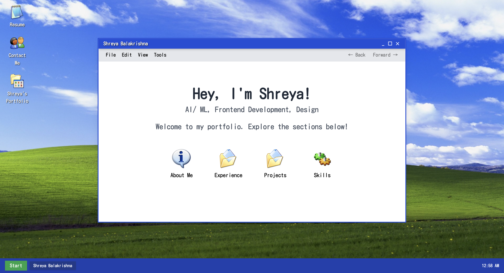
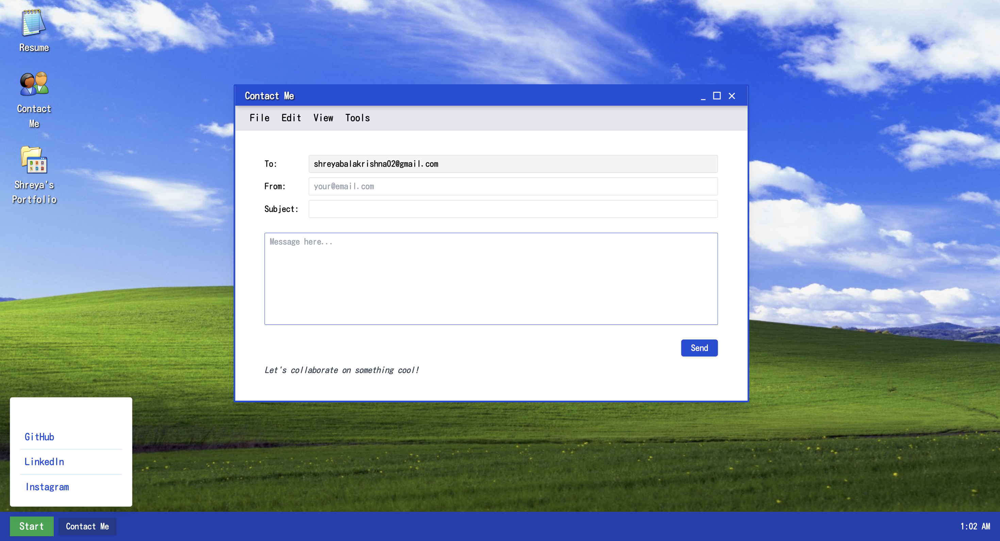

# Welcome to my Portfolio!


I have worked on a Windows XP-inspired, interactive portfolio built with React and TailwindCSS. This project showcases my work, experience, and design skills in a fun, desktop-like environment, complete with draggable windows, a start menu, and custom UI elements.

[Live Site on Netlify](https://shrxyo.netlify.app)

## Overview
- **Design:** Mimics the look and feel of Windows XP, with a modern twist and custom fonts.
- **Responsive:** Works beautifully on both desktop and mobile.
- **Interactive:** Draggable windows, animated taskbar, and clickable desktop icons.
- **Accessible:** Keyboard navigation and screen reader friendly.

## Tech Stack
- **React** (functional components, hooks)
- **TailwindCSS** (utility-first styling)
- **react-rnd** (draggable/resizable windows)
- **Custom assets** (icons, wallpaper, character art)

## Screenshots





## Getting Started
1. **Clone the repo:**
   ```bash
   git clone https://github.com/shrxyo/portfolio 
   cd portfolio
   ```
2. **Install dependencies:**
   ```bash
   npm install
   ```
3. **Run the development server:**
   ```bash
   npm run dev
   ```
4. **Open in your browser:**
   Visit `http://localhost:5173` 

## Folder Structure
- `src/components/` — All React components (DesktopIcons, Window, Taskbar, etc.)
- `src/assets/` — Images, icons, and custom art
- `src/data/` — Experience and project data (JSON)
- `src/index.css` — TailwindCSS setup

## Future Work
- 🎵 **Adding sound effects** for UI interactions and window actions
- 🎶 **Adding a personalized playlist** for background music
- 🔄 **Smoother userflow:** Ongoing improvements to navigation and transitions


---

**Made with ❤️ by shrxyo**
